# Visual Diagrams

These diagrams visualize the platform aligned with `ERD.md` (single source of truth). Copy any block into a PlantUML/Mermaid renderer (e.g., VS Code plugins, Kroki, Mermaid Live, PlantUML server) to view.

**Note:** All diagrams reflect the ERD defined in `ERD.md`, including pre-sign-in communication entities (PRE_SIGNIN_SESSIONS, PRE_SIGNIN_MESSAGES) and the Visitor actor, which are fully separated from authenticated user entities (USERS, THREADS, MESSAGES).

---

## Use Case Diagram (UML)

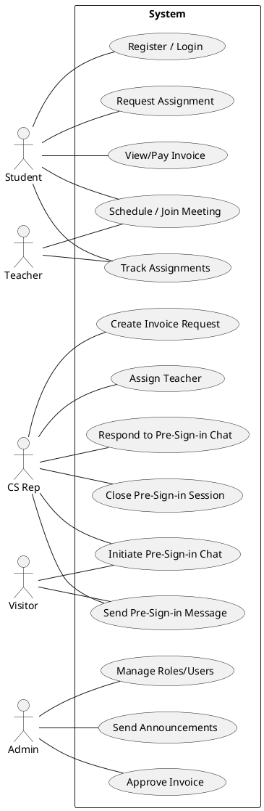

---

## System Context Diagram (C4-Context)

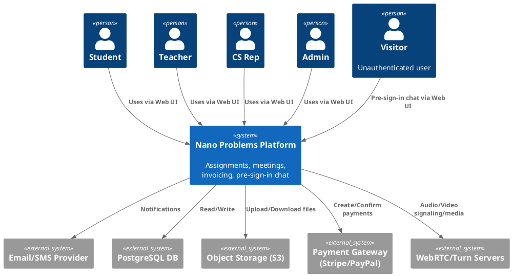

---

## Architectural Diagram (C4-Container)

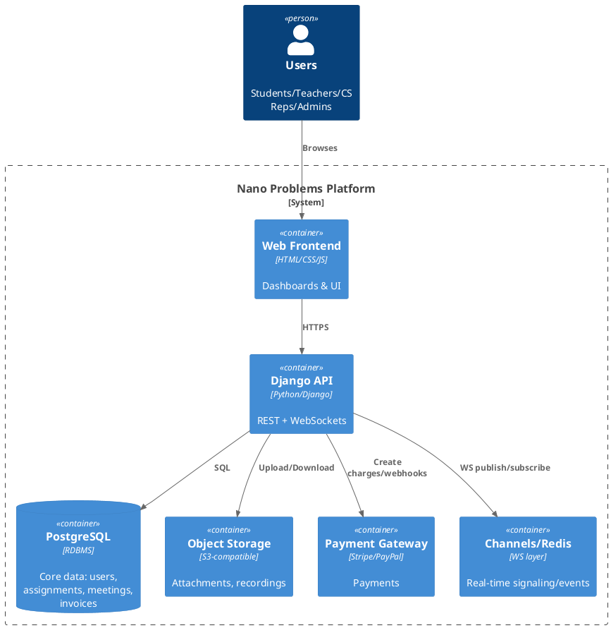

---

## Component Diagram (UML)

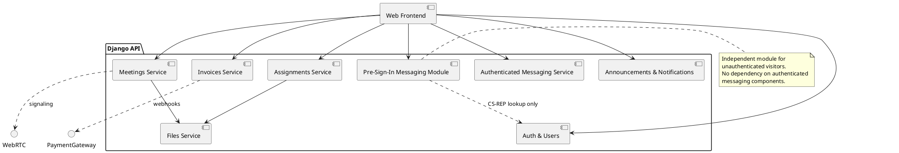

---

## Deployment Diagram (UML)

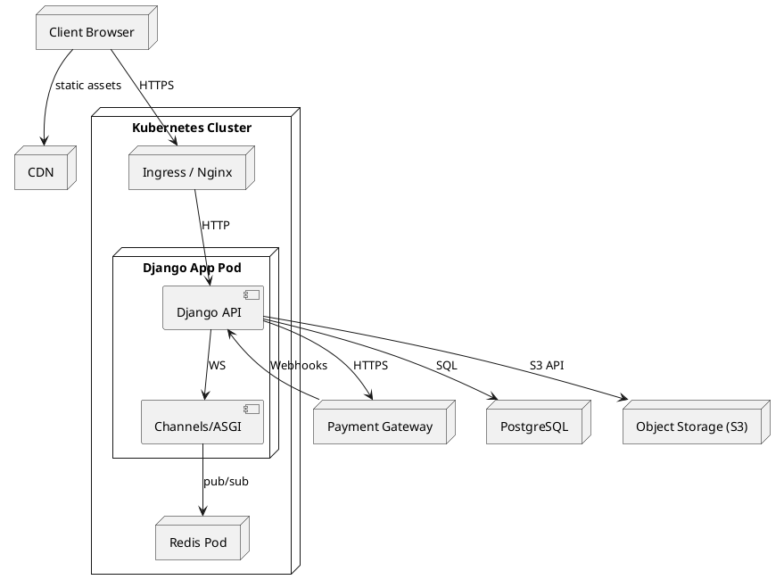

---

## Domain Model Diagram

```mermaid
classDiagram
    class Visitor {
        +string visitor_name
        +string visitor_email
        +string visitor_phone
    }
    
    class USERS {
        +int user_id PK
        +string role
        +string email
        +string username
        +boolean is_active
    }
    
    class STUDENTS {
        +int student_id PK
        +int user_id FK
        +string first_name
        +string last_name
    }
    
    class TEACHERS {
        +int teacher_id PK
        +int user_id FK
        +string first_name
        +string last_name
    }
    
    class CS_REPS {
        +int csrep_id PK
        +int user_id FK
        +string first_name
        +string last_name
    }
    
    class PRE_SIGNIN_SESSIONS {
        +int session_id PK
        +string visitor_name
        +string visitor_email
        +string visitor_phone
        +string subject
        +string status
        +int assigned_csrep_id FK
        +datetime started_at
        +datetime last_activity_at
    }
    
    class PRE_SIGNIN_MESSAGES {
        +int message_id PK
        +int session_id FK
        +int csrep_id FK
        +string sender_type
        +text content
        +datetime created_at
    }
    
    class THREADS {
        +int thread_id PK
        +string subject
        +string thread_type
        +string status
    }
    
    class MESSAGES {
        +int message_id PK
        +int thread_id FK
        +int sender_id FK
        +text content
    }
    
    Visitor --> PRE_SIGNIN_SESSIONS : initiates
    PRE_SIGNIN_SESSIONS --> PRE_SIGNIN_MESSAGES : contains
    CS_REPS --> PRE_SIGNIN_SESSIONS : handles
    CS_REPS --> PRE_SIGNIN_MESSAGES : responds
    
    USERS ||--|| STUDENTS : has
    USERS ||--|| TEACHERS : has
    USERS ||--|| CS_REPS : has
    
    USERS --> THREADS : participates via
    THREADS --> MESSAGES : contains
    
    note for Visitor "External entity - not part of USERS table"
    note for PRE_SIGNIN_SESSIONS "Separate from authenticated THREADS/MESSAGES"
```

---

## Sequence Diagram: CS Rep Creates Invoice → Admin Approves → Student Pays

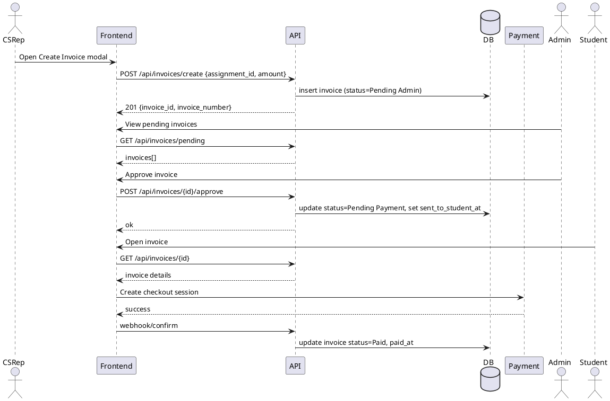

---

## Sequence Diagram: Pre-Sign-In Chat Flow

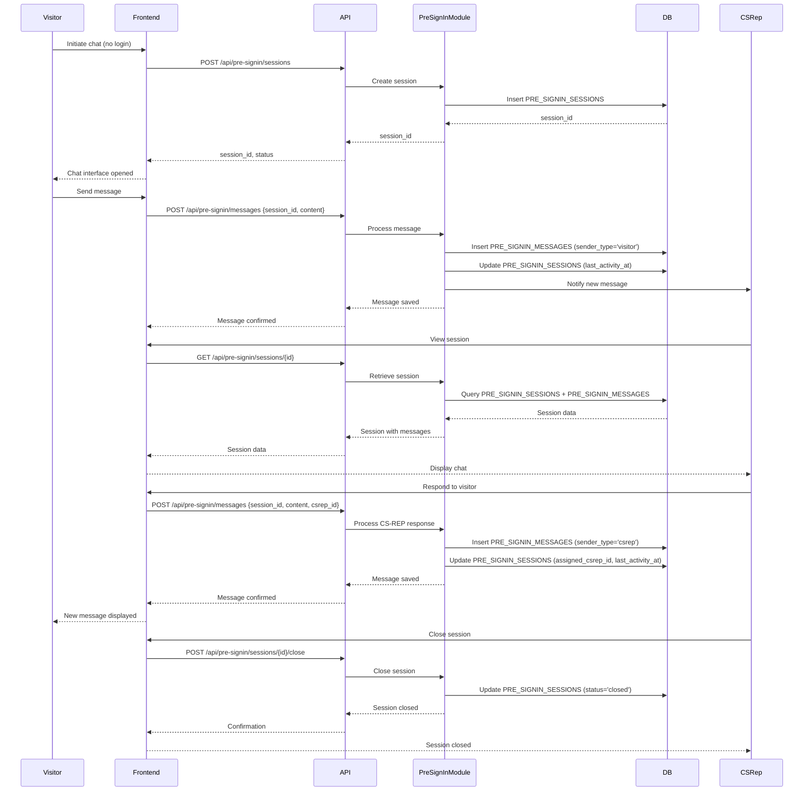

---

## Activity Diagram: Request New Assignment

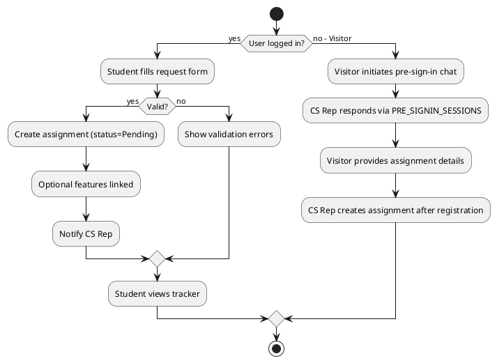

---

## State Machine: Assignment Lifecycle

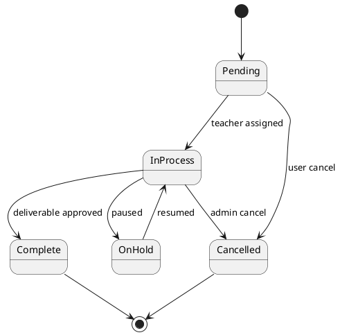

---

## API Design (OpenAPI excerpt)

```yaml
openapi: 3.0.3
info:
  title: Nano Problems API
  version: 1.0.0
servers:
  - url: https://api.nanoproblems.com
paths:
  /api/assignments/:
    get:
      summary: List assignments
      responses: { '200': { description: OK } }
    post:
      summary: Create assignment
      requestBody:
        required: true
        content:
          application/json:
            schema:
              type: object
              required: [title, description]
              properties:
                title: { type: string, maxLength: 200 }
                description: { type: string }
                subject: { type: string }
      responses: { '201': { description: Created } }
  /api/invoices/create/:
    post:
      summary: Create invoice request (CS Rep)
      requestBody:
        required: true
        content:
          application/json:
            schema:
              type: object
              required: [assignment_id, amount]
              properties:
                assignment_id: { type: string, format: uuid }
                amount: { type: number, format: float, minimum: 0.01 }
      responses: { '201': { description: Created } }
  /api/invoices/{id}/approve/:
    post:
      summary: Approve invoice (Admin)
      parameters:
        - in: path
          name: id
          schema: { type: string }
          required: true
      responses: { '200': { description: OK } }
```

---

## UI/UX Interaction Flow (Mermaid User Journey)

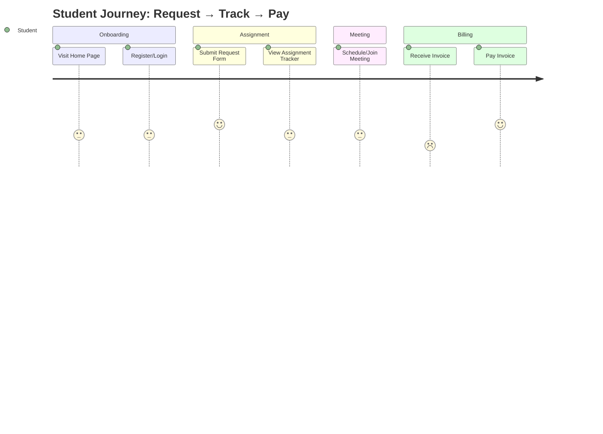

---

## UI/UX Interaction Flow – Visitor Pre-Sign-In Journey

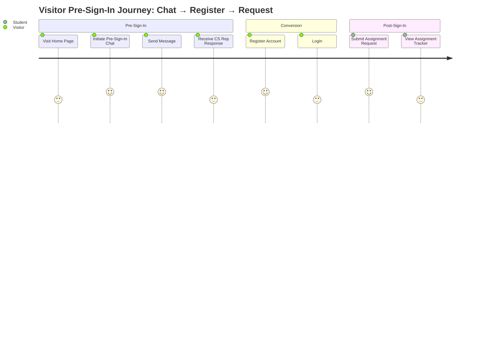

---

## Data Flow / Integration Diagram

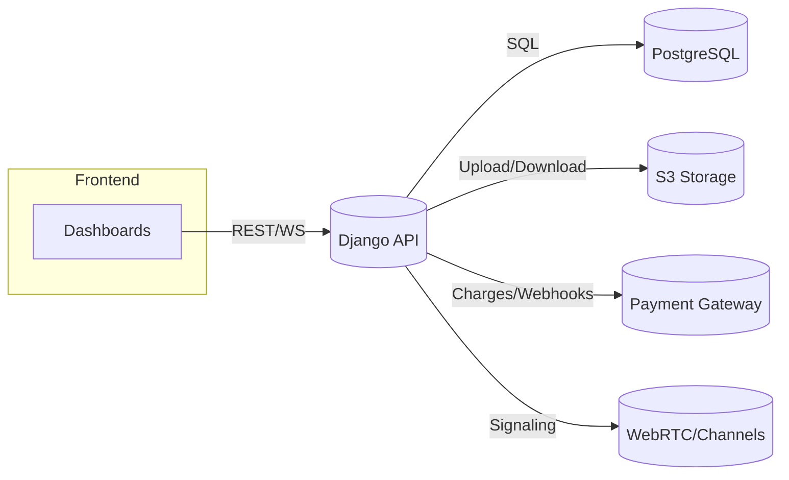

---

## Data Provenance / Lineage

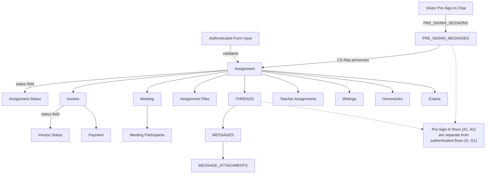

---

## ERD (Mermaid)

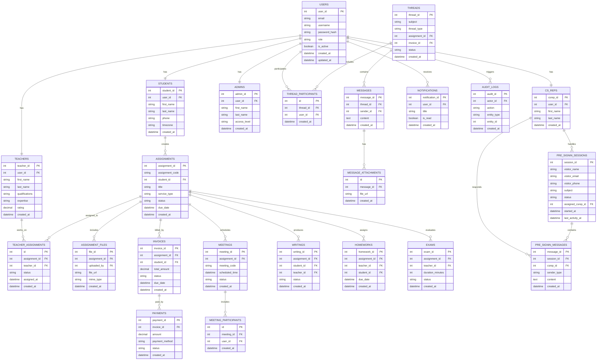

---

## System Architecture Diagram (Mermaid)

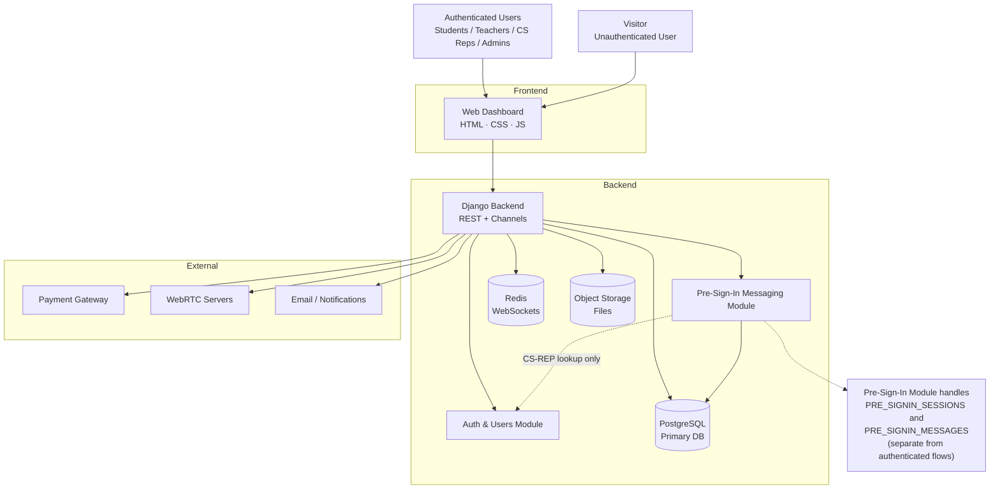

---

## Use Case Diagram (Mermaid)

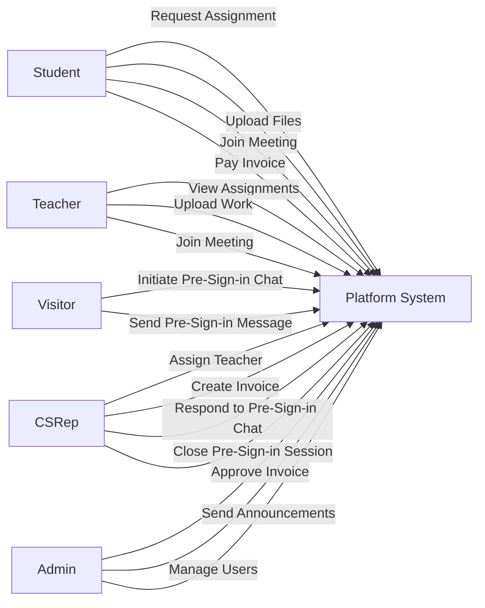

---

## Component Diagram (Mermaid)

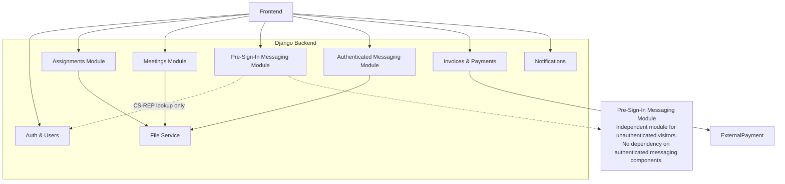

---

## Sequence Diagram – Assignment Lifecycle

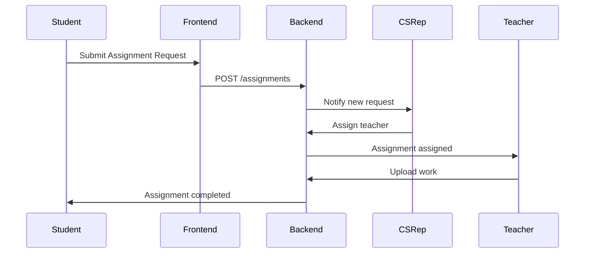

---

## Activity Diagram – Invoice Flow

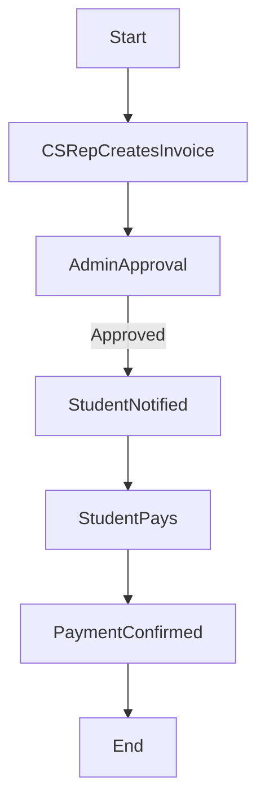

---

## Activity Diagram – User Entry Flow

```mermaid
flowchart TD
  Start([User arrives at platform])
  Start --> CheckAuth{User logged in?}
  CheckAuth -->|Yes| AuthenticatedFlow[Authenticated User Portal]
  CheckAuth -->|No| VisitorFlow[Visitor Pre-Sign-In Chat]
  
  AuthenticatedFlow --> StudentActions[Student: Request Assignment, Track, Pay]
  AuthenticatedFlow --> TeacherActions[Teacher: View Assignments, Upload Work]
  AuthenticatedFlow --> CSRepActions[CS Rep: Assign Teachers, Create Invoices]
  AuthenticatedFlow --> AdminActions[Admin: Approve Invoices, Manage Users]
  
  VisitorFlow --> InitiateChat[Visitor initiates PRE_SIGNIN_SESSIONS]
  InitiateChat --> SendMessage[Visitor sends PRE_SIGNIN_MESSAGES]
  SendMessage --> CSRepResponds[CS Rep responds via PRE_SIGNIN_MESSAGES]
  CSRepResponds --> CSRepCloses[CS Rep closes PRE_SIGNIN_SESSIONS]
  CSRepCloses --> End([End])
  
  StudentActions --> End
  TeacherActions --> End
  CSRepActions --> End
  AdminActions --> End
  
  note1["Pre-Sign-In flows use<br/>PRE_SIGNIN_SESSIONS and<br/>PRE_SIGNIN_MESSAGES<br/>(separate from authenticated<br/>THREADS and MESSAGES)"]
  VisitorFlow -.-> note1
```

---

## State Diagram – Assignment Status

```mermaid
stateDiagram-v2
  [*] --> Pending
  Pending --> InProgress : Teacher Assigned
  InProgress --> Completed : Work Delivered
  InProgress --> OnHold
  OnHold --> InProgress
  Pending --> Cancelled
  InProgress --> Cancelled
  Completed --> [*]
```

---

## Deployment Diagram (Mermaid)

```mermaid
flowchart LR
  Browser --> CDN
  CDN --> Nginx
  Nginx --> DjangoASGI
  DjangoASGI --> PostgreSQL
  DjangoASGI --> Redis
  DjangoASGI --> Storage
  DjangoASGI --> PaymentGateway
```

---

## Data Flow Diagram (DFD – Level 1)

```mermaid
flowchart LR
  User --> UI
  UI --> API
  API --> DB
  API --> Files
  API --> Payments
  API --> Notifications
```

---

Notes:
- All diagrams are aligned with `ERD.md` as the single source of truth.
- Pre-sign-in communication entities (PRE_SIGNIN_SESSIONS, PRE_SIGNIN_MESSAGES) and Visitor actor are included throughout.
- Pre-sign-in flows are fully separated from authenticated user entities (USERS, THREADS, MESSAGES).
- Replace external services with your actual providers as needed.

